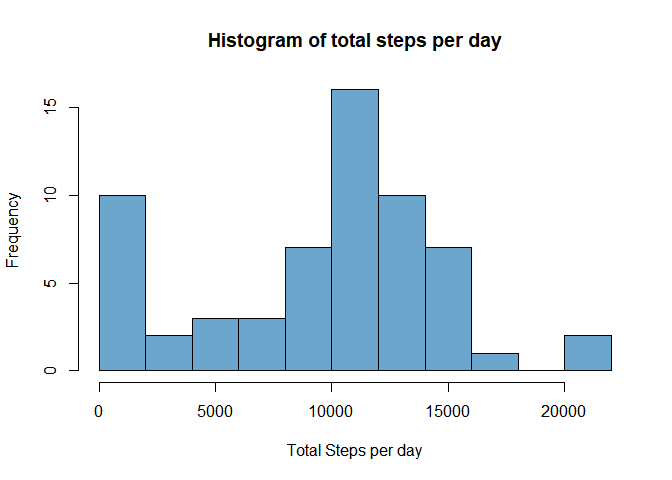
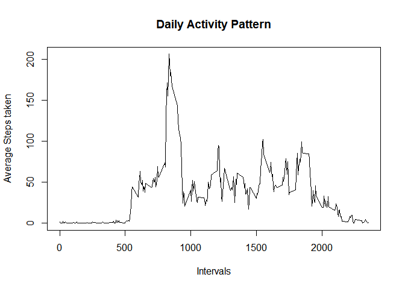

## Load required libraries

```r
library(dplyr, warn.conflicts = FALSE, quietly = TRUE)
library(knitr)
```

## Loading and preprocessing the data 
Load the data

```r
if (!exists("activity.csv") & exists("activity.zip")){
  unzip("activity.zip")
}
activity_raw <- read.csv("activity.csv")
```

Process/transform the data (if necessary) into a format suitable for your analysis

```r
# Convert the character type dates into Date class
activity_raw$date <- as.Date(activity_raw$date, "%Y-%m-%d")
```

## What is mean total number of steps taken per day?
Calculate the total number of steps taken per day

```r
total_number_of_steps_per_day <- activity_raw %>% 
  group_by(date) %>% 
  summarise(total.steps = sum(steps, na.rm = TRUE))

head(total_number_of_steps_per_day, 10)
```

```
## # A tibble: 10 x 2
##    date       total.steps
##    <date>           <int>
##  1 2012-10-01           0
##  2 2012-10-02         126
##  3 2012-10-03       11352
##  4 2012-10-04       12116
##  5 2012-10-05       13294
##  6 2012-10-06       15420
##  7 2012-10-07       11015
##  8 2012-10-08           0
##  9 2012-10-09       12811
## 10 2012-10-10        9900
```

Make a histogram of the total number of steps taken each day

```r
with(total_number_of_steps_per_day, hist(total.steps, 
                                         xlab = c("Total Steps per day"),
                                         main = c("Histogram of total steps per day"),
                                         col = "green"))
```

<!-- -->

Calculate and report the mean of the total number of steps taken per day

```r
sprintf("Mean Total Steps Per Day = %0.0f",
        total_number_of_steps_per_day %>% summarise(mean(total.steps, na.rm = TRUE)))
```

```
## [1] "Mean Total Steps Per Day = 9354"
```

Calculate and report the median of the total number of steps taken per day

```r
sprintf("Median Total Steps Per Day = %0.0f",
        total_number_of_steps_per_day %>% summarise(median(total.steps, na.rm = TRUE)))
```

```
## [1] "Median Total Steps Per Day = 10395"
```

## What is the average daily activity pattern?
Make a time series plot ( i.e. type = "l") of the 5-minute interval (x-axis) and the average number of steps taken, averaged across all days (y-axis)

```r
mean_daily_activity <- activity_raw %>% group_by(interval) %>% summarise(mean.steps = mean(steps, na.rm = TRUE))

with(mean_daily_activity, plot(interval, mean.steps, 
                               type='l',
                               xlab = "Intervals",
                               ylab = "Average Steps taken",
                               main = "Daily Activity Pattern"))
```

<!-- -->

Which 5-minute interval, on average across all the days in the dataset, contains the maximum number of steps?

```r
mean_daily_activity$interval[which.max(mean_daily_activity$mean.steps)]
```

[1] 835

## Imputing missing values
Calculate and report the total number of missing values in the dataset (i.e. the total number of rows with NAs

```r
sprintf("Total number of NAs = %0.0f", sum(is.na(activity_raw$steps)))
```

[1] "Total number of NAs = 2304"

Devise a strategy for filling in all of the missing values in the dataset. The strategy does not need to be sophisticated. For example, you could use the mean/median for that day, or the mean for that 5-minute interval, etc.

Create a new dataset that is equal to the original dataset but with the missing data filled in.

Make a histogram of the total number of steps taken each day and Calculate and report the mean and median total number of steps taken per day. Do these values differ from the estimates from the first part of the assignment? 

What is the impact of imputing missing data on the estimates of the total daily number of steps?

## Are there differences in activity patterns between weekdays and weekends?
Create a new factor variable in the dataset with two levels – “weekday” and “weekend” indicating whether a given date is a weekday or weekend day.

Make a panel plot containing a time series plot (i.e. \color{red}{\verb|type = "l"|}type = "l") of the 5-minute interval (x-axis) and the average number of steps taken, averaged across all weekday days or weekend days (y-axis). 
